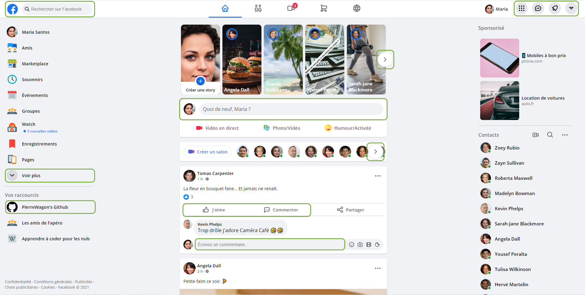
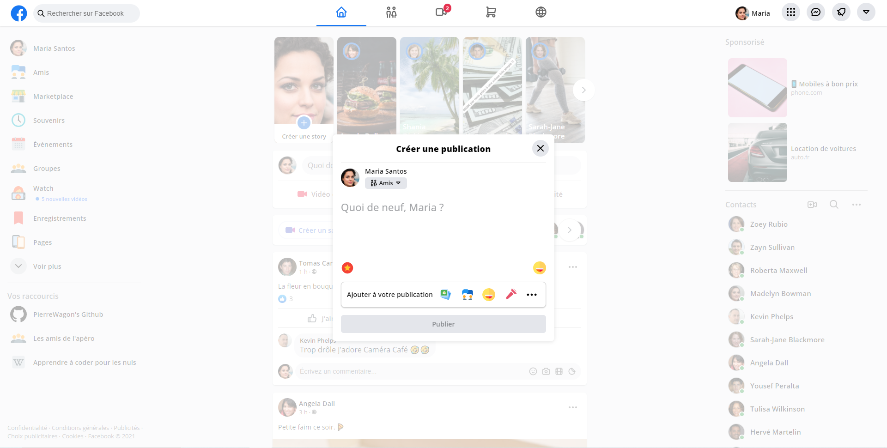

# Facebook Homepage Clone

Since I'm a beginner in Front-End Development, I wanted to improve by trying to reproduce a website that I know well.

## Features

#### Posts

- Create a new post

- Comment a post

- Like a post

#### Navigation

- Display different modals : Menu, Messenger, Notifications, More

- Scroll through stories and video contacts

- Display more options on left menu

- Display an animation using the search bar

- Mobile navigation menu for screens with a width of 1200px or less

## Screenshots

Green parts are the implemented features.

Post modal.

